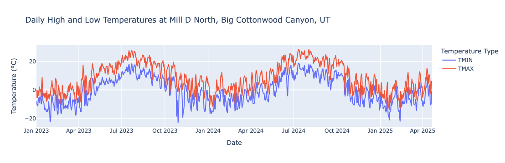
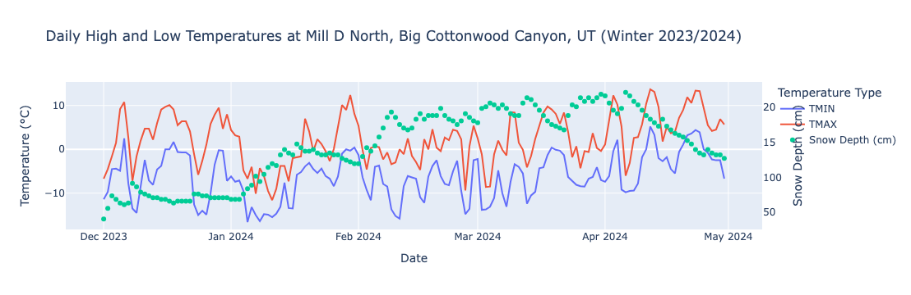

# NCEI Access Package Demo

This notebook demonstrates how to use the `ncei_access` package to retrieve and analyze weather data from NOAA's National Centers for Environmental Information (NCEI).

## Overview

The `ncei_access` package provides a convenient interface for:
- Finding weather stations by ID, location, or boundaries
- Retrieving daily weather data (temperature, snow depth, etc.)
- Working with weather station metadata
- Converting and analyzing weather data

## Installation and Setup

First, let's import the necessary packages and create an instance of the NceiAccessor class:


```python
# Create an instance of the NceiAccessor class to go weather-data-hunting.
from ncei_access import ncei_accessor as na
import pandas as pd
import plotly.express as px
from ncei_access import dataType_ref

ncei_db = na.NceiAccessor()
```

## Finding Weather Stations

### 1. Find Station by ID

If you know the station ID, you can directly retrieve station information. In this example, we'll look up the Mill D North station in Big Cottonwood Canyon, Utah (near Salt Lake City).


```python
# Find info about a specific weather station, whose station ID is known. In this case,
# the station ID is for Mill D North in Big Cottonwood Canyon. Close to SLC, Utah.
mill_d = ncei_db.find_station("USS0011J65S")

print(f"Station name: {mill_d.name}")  # Name of the station
print(f"Station ID: {mill_d.station_id}")  # Station ID
print(f"Station latitude: {mill_d.lat}")  # Latitude of the station
print(f"Station longitude: {mill_d.lon}")  # Longitude of the station
print(f"Station elevation: {mill_d.elevation()}")  # See docs for the hackiness of this method
print(f"Recorded datatypes at station: {mill_d.data_types}")  # Data types available at the station
print(f"Has TMAX?: {mill_d.has_data_type('TMAX')}")  # Check if the station has data_type TMAX
```

    Station name: MILL D NORTH, UT US
    Station ID: USS0011J65S
    Station latitude: 40.66
    Station longitude: -111.64
    Station elevation: 2733.1
    Recorded datatypes at station: [{'coverage': 99.33507170795306, 'endDate': '2025-06-21T23:59:59', 'dateRange': {'start': '2004-06-21T00:00:00', 'end': '2025-06-21T23:59:59'}, 'searchWeight': 1, 'id': 'TMAX', 'startDate': '2004-06-21T00:00:00'}, {'coverage': 100.0, 'endDate': '2025-06-21T23:59:59', 'dateRange': {'start': '1988-09-30T00:00:00', 'end': '2025-06-21T23:59:59'}, 'searchWeight': 1, 'id': 'WESD', 'startDate': '1988-09-30T00:00:00'}, {'coverage': 99.29595827900913, 'endDate': '2025-06-21T23:59:59', 'dateRange': {'start': '2004-06-21T00:00:00', 'end': '2025-06-21T23:59:59'}, 'searchWeight': 1, 'id': 'TAVG', 'startDate': '2004-06-21T00:00:00'}, {'coverage': 99.29595827900913, 'endDate': '2025-06-21T23:59:59', 'dateRange': {'start': '2004-06-21T00:00:00', 'end': '2025-06-21T23:59:59'}, 'searchWeight': 1, 'id': 'TMIN', 'startDate': '2004-06-21T00:00:00'}, {'coverage': 100.0, 'endDate': '2025-06-19T23:59:59', 'dateRange': {'start': '1988-10-01T00:00:00', 'end': '2025-06-19T23:59:59'}, 'searchWeight': 1, 'id': 'PRCP', 'startDate': '1988-10-01T00:00:00'}, {'coverage': 99.30899608865711, 'endDate': '2025-06-21T23:59:59', 'dateRange': {'start': '2004-06-21T00:00:00', 'end': '2025-06-21T23:59:59'}, 'searchWeight': 1, 'id': 'TOBS', 'startDate': '2004-06-21T00:00:00'}, {'coverage': 99.88265971316818, 'endDate': '2025-06-21T23:59:59', 'dateRange': {'start': '2004-06-21T00:00:00', 'end': '2025-06-21T23:59:59'}, 'searchWeight': 1, 'id': 'SNWD', 'startDate': '2004-06-21T00:00:00'}]
    Has TMAX?: True


### 2. Find Stations by Geographic Boundaries

You can search for all stations within a specific rectangular area defined by latitude and longitude boundaries:


```python
# Find all stations between latitudes 41°N and 40.5°N and between longitudes
# -111°W and -110.5°W (This is a rectangle that captures the top of the Mirror Lake
# Highway in Utah, USA).
stations_in_boundary_test = ncei_db.stations_in_boundary(41, -111, 40.5, -110.5)

# Returns a list of Station objects, which we can iterate over to see the details.
print(f"Found {len(stations_in_boundary_test)} stations in the specified boundary:")
for station in stations_in_boundary_test:
    print(f"Station name: {station.name}, ID: {station.station_id}")
```

    Found 13 stations in the specified boundary:
    Station name: TRIAL LAKE, UT US, ID: USS0010J52S
    Station name: BURTS MILLER RANCH, UT US, ID: USS0010J06S
    Station name: BEAR RIVER RANGER STATION, UT US, ID: USS0010J17S
    Station name: ROCK CREEK, UT US, ID: USS0010J18S
    Station name: STEEL CREEK PARK, UT US, ID: USS0010J20S
    Station name: EF BLACKS FORK GS, UT US, ID: USS0010J21S
    Station name: BLACKS FORK JCT, UT US, ID: USS0010J22S
    Station name: BUCK PASTURE, UT US, ID: USS0010J23S
    Station name: BROWN DUCK, UT US, ID: USS0010J30S
    Station name: LILY LAKE, UT US, ID: USS0010J35S
    Station name: HAYDEN FORK, UT US, ID: USS0010J44S
    Station name: BEAR RIVER UTAH, UT US, ID: USR0000BEAR
    Station name: BLACKS FORK COMMISSARY, UT US, ID: USC00420734


### 3. Find Closest Station to a Point

You can find the weather station closest to any given latitude and longitude:


```python
# Find the closest station to a specific latitude and longitude. In this case, we are
# looking for the closest station to second highest mountain in Utah, Mt Peale.
closest_to_peale = ncei_db.find_closest_station(38.438212, -109.228878)  # Mt Peale, UT
print(f"Closest station to Mt Peale: {closest_to_peale.name}, ID: {closest_to_peale.station_id}")
```

    Closest station to Mt Peale: LASAL MOUNTAIN, UT US, ID: USS0009L03S


## Retrieving Weather Data

### Getting Snow Depth Data

The Mill D North station is a SNOTEL site that records daily snow depth (SNWD). Let's retrieve the daily snow depth data since January 1, 2023:


```python
# Get daily snow depth data
mill_d_sd = ncei_db.get_daily(
    data_types=["SNWD"],  # Snow depth
    stations=mill_d.station_id,  # Station ID
    start="2023-01-01",  # Start date for the data
)

# Convert to pandas DataFrame for easier manipulation
mill_d_sd_df = pd.DataFrame(mill_d_sd).dropna()
print(f"Retrieved {len(mill_d_sd_df)} records of snow depth data")
mill_d_sd_df.head()
```

    Retrieved 842 records of snow depth data


<div>
<style scoped>
    .dataframe tbody tr th:only-of-type {
        vertical-align: middle;
    }

    .dataframe tbody tr th {
        vertical-align: top;
    }

    .dataframe thead th {
        text-align: right;
    }
</style>
<table border="1" class="dataframe">
  <thead>
    <tr style="text-align: right;">
      <th></th>
      <th>DATE</th>
      <th>STATION</th>
      <th>SNWD</th>
    </tr>
  </thead>
  <tbody>
    <tr>
      <th>0</th>
      <td>2023-01-01</td>
      <td>USS0011J65S</td>
      <td>1829</td>
    </tr>
    <tr>
      <th>1</th>
      <td>2023-01-02</td>
      <td>USS0011J65S</td>
      <td>1753</td>
    </tr>
    <tr>
      <th>2</th>
      <td>2023-01-03</td>
      <td>USS0011J65S</td>
      <td>1727</td>
    </tr>
    <tr>
      <th>3</th>
      <td>2023-01-04</td>
      <td>USS0011J65S</td>
      <td>1676</td>
    </tr>
    <tr>
      <th>4</th>
      <td>2023-01-05</td>
      <td>USS0011J65S</td>
      <td>1727</td>
    </tr>
  </tbody>
</table>
</div>


### Understanding Data Types and Units

It's important to understand the units and scale factors for each data type. Let's examine the snow depth data type:


```python
# Look up the data type reference to understand units and scale factors
print("Snow depth (SNWD) data type reference:")
print(dataType_ref["SNWD"].__dict__)
```

    Snow depth (SNWD) data type reference:
    {'id': 'SNWD', 'name': 'Snow depth (mm)', 'units': 'millimeters', 'metric_output_units': 'millimeters', 'metric_output_precision': 1, 'standard_output_units': 'inches', 'standard_output_precision': 1, 'scale_factor': 1, 'scale_weight': None}


```python
# Convert data types and apply scale factors
mill_d_sd_df = mill_d_sd_df.astype({"DATE": "datetime64[s]", "SNWD": float})
mill_d_sd_df["SNWD"] = mill_d_sd_df["SNWD"] / 10  # Convert from mm to cm

print("Processed snow depth data:")
mill_d_sd_df.head()
```

    Processed snow depth data:


<div>
<style scoped>
    .dataframe tbody tr th:only-of-type {
        vertical-align: middle;
    }

    .dataframe tbody tr th {
        vertical-align: top;
    }

    .dataframe thead th {
        text-align: right;
    }
</style>
<table border="1" class="dataframe">
  <thead>
    <tr style="text-align: right;">
      <th></th>
      <th>DATE</th>
      <th>STATION</th>
      <th>SNWD</th>
    </tr>
  </thead>
  <tbody>
    <tr>
      <th>0</th>
      <td>2023-01-01</td>
      <td>USS0011J65S</td>
      <td>182.9</td>
    </tr>
    <tr>
      <th>1</th>
      <td>2023-01-02</td>
      <td>USS0011J65S</td>
      <td>175.3</td>
    </tr>
    <tr>
      <th>2</th>
      <td>2023-01-03</td>
      <td>USS0011J65S</td>
      <td>172.7</td>
    </tr>
    <tr>
      <th>3</th>
      <td>2023-01-04</td>
      <td>USS0011J65S</td>
      <td>167.6</td>
    </tr>
    <tr>
      <th>4</th>
      <td>2023-01-05</td>
      <td>USS0011J65S</td>
      <td>172.7</td>
    </tr>
  </tbody>
</table>
</div>


### Getting Daily High and Low Temperatures

The package includes a convenience function for retrieving daily high and low temperatures:


```python
# Get daily high and low temperatures using the convenience function
mill_d_hilow = ncei_db.get_daily_hilow(
    stations=mill_d.station_id,  # Station ID
    start="2023-01-01",  # Start date for the data
)

# Convert to pandas DataFrame
mill_d_hilow_df = pd.DataFrame(mill_d_hilow).dropna()
print(f"Retrieved {len(mill_d_hilow_df)} records of temperature data")
mill_d_hilow_df.head()
```

    Retrieved 841 records of temperature data


<div>
<style scoped>
    .dataframe tbody tr th:only-of-type {
        vertical-align: middle;
    }

    .dataframe tbody tr th {
        vertical-align: top;
    }

    .dataframe thead th {
        text-align: right;
    }
</style>
<table border="1" class="dataframe">
  <thead>
    <tr style="text-align: right;">
      <th></th>
      <th>DATE</th>
      <th>STATION</th>
      <th>TMAX</th>
      <th>TMIN</th>
    </tr>
  </thead>
  <tbody>
    <tr>
      <th>0</th>
      <td>2023-01-01</td>
      <td>USS0011J65S</td>
      <td>-1</td>
      <td>-81</td>
    </tr>
    <tr>
      <th>1</th>
      <td>2023-01-02</td>
      <td>USS0011J65S</td>
      <td>-53</td>
      <td>-101</td>
    </tr>
    <tr>
      <th>2</th>
      <td>2023-01-03</td>
      <td>USS0011J65S</td>
      <td>-55</td>
      <td>-111</td>
    </tr>
    <tr>
      <th>3</th>
      <td>2023-01-04</td>
      <td>USS0011J65S</td>
      <td>-3</td>
      <td>-111</td>
    </tr>
    <tr>
      <th>4</th>
      <td>2023-01-05</td>
      <td>USS0011J65S</td>
      <td>-10</td>
      <td>-57</td>
    </tr>
  </tbody>
</table>
</div>


### Understanding Temperature Data Units

Let's examine the temperature data type references to understand the scale factors:


```python
# Check the data type references for temperature data
print("Daily maximum temperature (TMAX) data type reference:")
print(dataType_ref["TMAX"].__dict__)
print("\nDaily minimum temperature (TMIN) data type reference:")
print(dataType_ref["TMIN"].__dict__)
```

    Daily maximum temperature (TMAX) data type reference:
    {'id': 'TMAX', 'name': 'Maximum temperature (tenths of degrees C)', 'units': 'celsius', 'metric_output_units': 'celsius', 'metric_output_precision': 1, 'standard_output_units': 'fahrenheit', 'standard_output_precision': 0, 'scale_factor': 0.1, 'scale_weight': None}
    
    Daily minimum temperature (TMIN) data type reference:
    {'id': 'TMIN', 'name': 'Minimum temperature (tenths of degrees C)', 'units': 'celsius', 'metric_output_units': 'celsius', 'metric_output_precision': 1, 'standard_output_units': 'fahrenheit', 'standard_output_precision': 0, 'scale_factor': 0.1, 'scale_weight': None}


```python
# Convert temperature data (note the scale factor is 0.1 - values are in tenths of degrees Celsius)
mill_d_hilow_df = mill_d_hilow_df.astype({
    "DATE": "datetime64[s]", 
    "TMAX": float, 
    "TMIN": float
})
mill_d_hilow_df["TMAX"] = mill_d_hilow_df["TMAX"] / 10  # Convert from tenths of degrees C to degrees C
mill_d_hilow_df["TMIN"] = mill_d_hilow_df["TMIN"] / 10  # Convert from tenths of degrees C to degrees C

print("Processed temperature data:")
mill_d_hilow_df.head()
```

    Processed temperature data:


<div>
<style scoped>
    .dataframe tbody tr th:only-of-type {
        vertical-align: middle;
    }

    .dataframe tbody tr th {
        vertical-align: top;
    }

    .dataframe thead th {
        text-align: right;
    }
</style>
<table border="1" class="dataframe">
  <thead>
    <tr style="text-align: right;">
      <th></th>
      <th>DATE</th>
      <th>STATION</th>
      <th>TMAX</th>
      <th>TMIN</th>
    </tr>
  </thead>
  <tbody>
    <tr>
      <th>0</th>
      <td>2023-01-01</td>
      <td>USS0011J65S</td>
      <td>-0.1</td>
      <td>-8.1</td>
    </tr>
    <tr>
      <th>1</th>
      <td>2023-01-02</td>
      <td>USS0011J65S</td>
      <td>-5.3</td>
      <td>-10.1</td>
    </tr>
    <tr>
      <th>2</th>
      <td>2023-01-03</td>
      <td>USS0011J65S</td>
      <td>-5.5</td>
      <td>-11.1</td>
    </tr>
    <tr>
      <th>3</th>
      <td>2023-01-04</td>
      <td>USS0011J65S</td>
      <td>-0.3</td>
      <td>-11.1</td>
    </tr>
    <tr>
      <th>4</th>
      <td>2023-01-05</td>
      <td>USS0011J65S</td>
      <td>-1.0</td>
      <td>-5.7</td>
    </tr>
  </tbody>
</table>
</div>


## Data Visualization

### Plotting Temperature Data

Let's create a time series plot of the daily high and low temperatures:


```python
# Plot daily high and low temperatures
fig = px.line(
    mill_d_hilow_df,
    x="DATE",
    y=["TMIN", "TMAX"],
    labels={"value": "Temperature (°C)", "variable": "Temperature Type"},
    title="Daily High and Low Temperatures at Mill D North, Big Cottonwood Canyon, UT",
)
fig.update_layout(
    xaxis_title="Date",
    yaxis_title="Temperature (°C)",
    legend_title="Temperature Type",
)
fig.show()
```


    

    


## Advanced Analysis: Combining Temperature and Snow Depth Data

### Merging Datasets

Let's combine the temperature and snow depth data to analyze their relationship:


```python
# Join snow depth and temperature dataframes on date
mill_d_combined_df = pd.merge(
    mill_d_sd_df, mill_d_hilow_df, on=["DATE", "STATION"], how="inner"
)

print(f"Combined dataset has {len(mill_d_combined_df)} records")
mill_d_combined_df.head()
```

    Combined dataset has 841 records


<div>
<style scoped>
    .dataframe tbody tr th:only-of-type {
        vertical-align: middle;
    }

    .dataframe tbody tr th {
        vertical-align: top;
    }

    .dataframe thead th {
        text-align: right;
    }
</style>
<table border="1" class="dataframe">
  <thead>
    <tr style="text-align: right;">
      <th></th>
      <th>DATE</th>
      <th>STATION</th>
      <th>SNWD</th>
      <th>TMAX</th>
      <th>TMIN</th>
    </tr>
  </thead>
  <tbody>
    <tr>
      <th>0</th>
      <td>2023-01-01</td>
      <td>USS0011J65S</td>
      <td>182.9</td>
      <td>-0.1</td>
      <td>-8.1</td>
    </tr>
    <tr>
      <th>1</th>
      <td>2023-01-02</td>
      <td>USS0011J65S</td>
      <td>175.3</td>
      <td>-5.3</td>
      <td>-10.1</td>
    </tr>
    <tr>
      <th>2</th>
      <td>2023-01-03</td>
      <td>USS0011J65S</td>
      <td>172.7</td>
      <td>-5.5</td>
      <td>-11.1</td>
    </tr>
    <tr>
      <th>3</th>
      <td>2023-01-04</td>
      <td>USS0011J65S</td>
      <td>167.6</td>
      <td>-0.3</td>
      <td>-11.1</td>
    </tr>
    <tr>
      <th>4</th>
      <td>2023-01-05</td>
      <td>USS0011J65S</td>
      <td>172.7</td>
      <td>-1.0</td>
      <td>-5.7</td>
    </tr>
  </tbody>
</table>
</div>


### Winter Season Analysis

Let's focus on the winter and spring months of the 2023/2024 season to see the relationship between temperature and snow depth:


```python
# Subset the data to just the winter and spring months of the 2023/2024 season
winter_2024 = mill_d_combined_df[
    (mill_d_combined_df["DATE"] >= "2023-12-01")
    & (mill_d_combined_df["DATE"] < "2024-05-01")
].copy()

print(f"Winter 2023/2024 dataset has {len(winter_2024)} records")
winter_2024.head()
```

    Winter 2023/2024 dataset has 152 records


<div>
<style scoped>
    .dataframe tbody tr th:only-of-type {
        vertical-align: middle;
    }

    .dataframe tbody tr th {
        vertical-align: top;
    }

    .dataframe thead th {
        text-align: right;
    }
</style>
<table border="1" class="dataframe">
  <thead>
    <tr style="text-align: right;">
      <th></th>
      <th>DATE</th>
      <th>STATION</th>
      <th>SNWD</th>
      <th>TMAX</th>
      <th>TMIN</th>
    </tr>
  </thead>
  <tbody>
    <tr>
      <th>334</th>
      <td>2023-12-01</td>
      <td>USS0011J65S</td>
      <td>40.6</td>
      <td>-6.7</td>
      <td>-11.4</td>
    </tr>
    <tr>
      <th>335</th>
      <td>2023-12-02</td>
      <td>USS0011J65S</td>
      <td>55.9</td>
      <td>-4.5</td>
      <td>-9.7</td>
    </tr>
    <tr>
      <th>336</th>
      <td>2023-12-03</td>
      <td>USS0011J65S</td>
      <td>73.7</td>
      <td>-1.6</td>
      <td>-4.5</td>
    </tr>
    <tr>
      <th>337</th>
      <td>2023-12-04</td>
      <td>USS0011J65S</td>
      <td>68.6</td>
      <td>1.5</td>
      <td>-4.4</td>
    </tr>
    <tr>
      <th>338</th>
      <td>2023-12-05</td>
      <td>USS0011J65S</td>
      <td>63.5</td>
      <td>9.2</td>
      <td>-4.9</td>
    </tr>
  </tbody>
</table>
</div>


### Dual-Axis Visualization

Create a plot showing both temperature and snow depth on the same chart with dual y-axes:


```python
# Plot daily high and low temperatures with snow depth on a dual y-axis
fig = px.line(
    winter_2024,
    x="DATE",
    y=["TMIN", "TMAX"],
    labels={"value": "Temperature (°C)", "variable": "Temperature Type"},
    title="Daily High and Low Temperatures at Mill D North, Big Cottonwood Canyon, UT (Winter 2023/2024)",
)
fig.update_layout(
    xaxis_title="Date",
    yaxis_title="Temperature (°C)",
    legend_title="Temperature Type",
)

# Add snow depth on secondary y-axis
fig.add_scatter(
    x=winter_2024["DATE"],
    y=winter_2024["SNWD"],
    mode="markers",
    name="Snow Depth (cm)",
    yaxis="y2",  # Use a secondary y-axis for snow depth
)

fig.update_layout(
    yaxis2=dict(
        title="Snow Depth (cm)",
        overlaying="y",
        side="right",
        showgrid=False,
        zeroline=False,
    )
)

fig.show()
```


    

    


## Key Observations

From this analysis, you can observe:

- **Inverse relationship**: When temperatures get high, snow depth tends to decrease (melting)
- **Snow accumulation**: When temperatures get low, snow depth tends to increase
- **Seasonal patterns**: Clear winter accumulation and spring melt patterns

## Next Steps

This example demonstrates the basic capabilities of the `ncei_access` package. From here, you could:

- Calculate rates of change in snow depth relative to temperature
- Perform statistical analysis on the temperature-snow depth relationship
- Compare data across multiple stations
- Analyze long-term climate trends
- Incorporate additional weather variables (precipitation, wind, etc.)

The `ncei_access` package provides the foundation for retrieving and working with weather data, enabling you to focus on your specific analysis goals.
